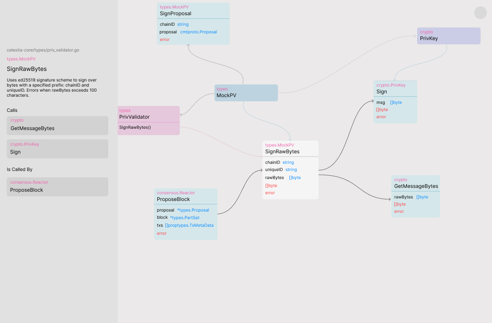
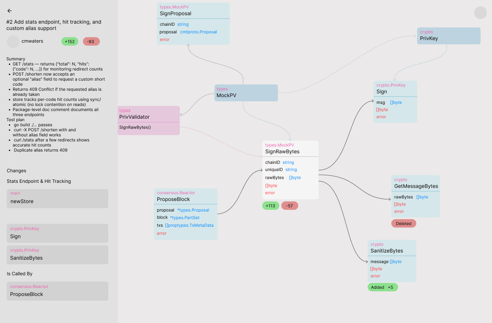
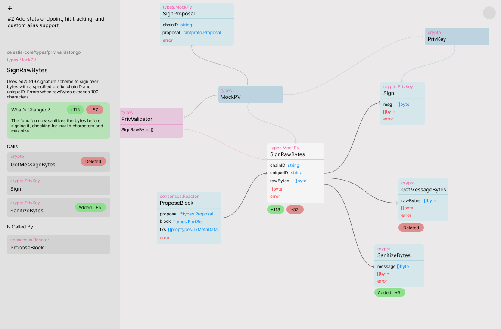

# Isoprism — UI Brief

> For AI generation and Figma design | Updated: 2026-04-24

---

## Design Language

**Typeface:** Inter (or equivalent geometric sans-serif). All body text 14–15px. Headings 20–28px. Monospace (JetBrains Mono or similar) for function signatures and code.

**Palette:**
- Background: `#EBE9E9` (warm off-white)
- Surface: `#E1E1E1` (sidebars, panels)
- Surface raised: `#D8D8D8` (selected states)
- Border: `#D4D4D4`
- Text primary: `#111111`
- Text secondary: `#666666`
- Text muted: `#888888`
- Text faint: `#AAAAAA`
- Accent (changed nodes / CTA): `#6366F1` (indigo-500)
- Accent dim (caller/callee nodes): `#C7D2FE` (indigo-200, border) with `#6366F1` (text)
- Success: `#22C55E`
- Destructive: `#EF4444`

**Aesthetic:** Light, minimal, instrument-like. High contrast between text and background. No gradients. No shadows except subtle `box-shadow: 0 1px 4px rgba(0,0,0,0.08)` for card borders.

**Spacing system:** 4px base unit. Common values: 8, 12, 16, 20, 24, 32, 48px.

**Motion:** Subtle only. 150ms ease-out for state transitions. No entrance animations.

---

## Screen 1 — Login

**Layout:** Full viewport. Vertically and horizontally centred content column, max-width 360px.

**Content (top to bottom):**
1. Isoprism logo mark — a small abstract graph icon (3 nodes connected by 2 edges), 32×32px, `#111111`
2. Product name "Isoprism" in 20px semibold, `#111111`, 12px below the logo
3. 48px gap
4. Headline: "Understand what your PRs actually change." — 28px, semibold, `#111111`, centered, max 2 lines
5. Subheading: "A graph view of every function affected. Plain-language summaries. No diffs." — 15px, `#666666`, centered, 12px below headline
6. 40px gap
7. **GitHub sign-in button** — full width, 48px height, `#111111` background, white text, 8px border-radius. GitHub Octocat icon (20px) left of text "Continue with GitHub". On hover: `#333333` background.
8. 48px gap below button
9. Fine print: "By signing in you authorise read access to your repositories." — 12px, `#888888`, centered

**Background:** Solid `#EBE9E9`. No image, no pattern.

---

## Screen 2 — Repo Selection

**Layout:** Full viewport. Two zones:
- Left sidebar (240px wide, full height, `#E1E1E1` background, `#D4D4D4` right border)
- Main content area (remaining width, `#EBE9E9` background)

**Left Sidebar:**
- Isoprism logo mark + "Isoprism" wordmark at top, 20px padding

**Main Content (centred column, max-width 560px, vertically centred in viewport):**
1. Heading: "Select a repository" — 24px semibold, `#111111`
2. Subheading: "Isoprism will index this repository's pull requests." — 15px, `#666666`, 8px below heading
3. 24px gap
4. **Search input** — full width, 44px height, white background, `#D4D4D4` border, 6px border-radius. Placeholder: "Search repositories…" in `#AAAAAA`. Magnifier icon on left inside.
5. 16px gap
6. **Repository list** — scrollable, max-height ~400px. Each row:
   - Height: 56px
   - White background, `#D4D4D4` border, 6px border-radius, 1px gap between rows
   - Left: repo name in 14px semibold `#111111` + org/owner prefix in `#888888` 13px
   - Right: branch badge (e.g. "main") in `#EBE9E9` with `#D4D4D4` border, 11px `#888888` text
   - Selected state: `#D8D8D8` background, `#6366F1` left border (3px), repo name in `#6366F1`
   - Hover state: `#F0F0F0` background
7. 24px gap
8. **Continue button** — right-aligned, 180px wide, 44px height, `#6366F1` background, white text "Index repository →", 6px border-radius. Disabled (opacity 0.4) until a repo is selected.

---

## Screen 3 — Indexing State (transient)

**Layout:** Same two-zone layout as Screen 2. Main content centred column, max-width 480px.

**Content:**
1. Repo name + GitHub icon in small badge at top: `acme/backend`
2. 32px gap
3. Animated progress indicator — a horizontal bar, `#D4D4D4` track, `#6366F1` fill that animates from 0 to ~70% over 3 seconds then pulses. Width: full column. Height: 3px.
4. 16px gap
5. Status label — 14px, `#666666`, left-aligned under the bar. Cycles through:
   - "Fetching pull requests…"
   - "Analysing changed functions…"
   - "Building call graphs…"
   (Each phase lasts ~1.5s, fades between them)
6. When complete, transition immediately to Screen 4 (PR Queue).

---

## Screen 4 — PR Queue

**Layout:** Same two-zone layout. Main content column max-width 720px, top padding 48px.

**Content:**
1. Breadcrumb: small text `acme/backend` in `#888888`, 13px, at top
2. 8px gap
3. Heading: "Pull requests" — 22px semibold, `#111111`
4. Subheading: "Top 5 open PRs ranked by wait time and impact." — 14px, `#666666`, 8px below
5. 24px gap
6. **PR List** — up to 5 rows. Each row is a card:
   - Height: auto, min 72px
   - White background, `#D4D4D4` border, 8px border-radius
   - 12px gap between cards
   - Hover state: `#F5F5F5` background, cursor pointer
   - **Left edge accent bar** (4px wide, full height): `#6366F1` for the highest urgency PR, `#C7D2FE` for the rest
   
   **Card layout (16px internal padding):**
   - Row 1: PR number `#AAAAAA · #42` and title `#111111` 15px semibold, inline
   - Row 2 (8px below): One-line AI summary — 14px `#666666`
   - Row 3 (10px below): Three small badges inline:
     - Time open: clock icon + "3 days" — `#F0F0F0` bg, `#D4D4D4` border, `#666666` text, 11px
     - Functions affected: graph-node icon + "12 functions" — same style
     - Risk: coloured dot + "Medium risk" — dot colour matches risk level (green/amber/red), `#666666` text
   - Far right: chevron `›` in `#AAAAAA`, vertically centred

---

## Screen 5 — PR Graph View

This is the primary screen. It has three distinct sub-views depending on context.

```
┌──────────────────┬───────────────────────────────────────┐
│                  │                                       │
│  Left Panel      │  Graph Canvas                        │
│  (~280px)        │  (remaining width)                   │
│                  │                                       │
└──────────────────┴───────────────────────────────────────┘
```

### Sub-view A — Repo browse (no PR, no node selected)



Left panel shows "Select a node to inspect it." placeholder. Canvas shows the static graph for the repo's main branch — all nodes plain (no diff state).

---

### Sub-view B — PR open, no node selected



The left panel shows PR summary information. Canvas shows the PR diff graph with diff pills below changed nodes.

**Left Panel — PR Summary:**

Top section (20px padding):
1. **PR number** — `#N` in 11px `#AAAAAA`
2. **PR title** — 15px semibold, `#111111`, 4px below number
3. 12px gap
4. **Author chip** — small pill: `#F0F0F0` background, `#D4D4D4` border, 11px, author username
5. 16px gap
6. **Description section** — label "Description" in 11px uppercase `#AAAAAA`, then the PR body text (the PR description / first comment) rendered as rich GitHub-flavored Markdown, 13px `#555555`, line-height 1.6. Headings, links, lists, tables, checkboxes, blockquotes, and inline/fenced code use compact panel styling and wrap within the left panel.
7. 16px gap
8. **Changes section** — label "Changes" in 11px uppercase `#AAAAAA`, then a list of changed node rows:
    - Each row: package label (11px, fuchsia `#EF5DA8`) + function name (13px `#222222`) in a light `#F0F0F0` pill, 4px border-radius, 6px horizontal padding, clickable (selects the node)

---

### Sub-view C — PR open, node selected



Left panel reverts to node detail. Changed nodes gain inline status in the Calls/Called-by sections.

**Left Panel — Node Detail (20px padding):**

1. **← Back** — top-left control styled exactly like the PR overview back link; clears selection and returns to Sub-view B
2. **File path** — `path/to/file.go` — 11px, `#AAAAAA`, 8px below the back control
3. **Package label** — e.g. `types.MockPV` — 11px, `#EF5DA8`, 4px below file path
4. **Function name** — 22px semibold, `#111111`, 4px below package label
5. **Description** — 14px, `#555555`, line-height 1.6, 12px below name
6. **"What's Changed?" card** (only for directly modified functions) — 16px below description:
   - Container: `#F0FFF4` background, `#BBF7D0` left border (3px), 8px border-radius, 12px padding
   - Header row: "What's Changed?" label (12px semibold `#166534`) + inline `+N` / `-N` stat pills
   - Body: 13px, `#333333`, line-height 1.6 — the change summary text
7. **"Calls" section** — 20px below:
   - Label: "Calls" — 11px uppercase `#AAAAAA`, letter-spacing 0.08em
   - Each row: package label (11px, fuchsia) + function name (13px `#222222`)
   - If the callee is itself a changed node, show its status badge inline on the right:
     - "Deleted" — `#FEE2E2` bg, `#EF4444` text, 10px, 4px border-radius
     - "Added +N" — `#DCFCE7` bg, `#16A34A` text
8. **"Is Called By" section** — 16px below Calls, same row structure with status badges

---

### Graph Canvas (remaining width, `#EBE9E9` background)

**Top bar** (`#E1E1E1` background, `#D4D4D4` bottom border, 48px height):
- Left: "← Back" link in `#888888`, separator `·`, PR number in `#888888`, PR title in `#111111` semibold.
- Right: "View on GitHub →" link in `#6366F1`.

**Graph layout:** Concentric rings. Changed nodes sit at the centre; BFS assigns each connected node a ring level. Outer rings are evenly distributed around a circle whose radius adapts to node count (`max(level × 380px, count × 300px / 2π)`). Pan and zoom freely.

**Node color by kind:**

| Kind | Background |
|---|---|
| `function`, `method` | `#D5E7EB` (steel blue-grey) |
| `struct`, `type` | `#CBCCE5` (lavender) |
| `interface` | `#E5C8DC` (rose) |
| Selected (any kind) | `#F5F5F5` |

**Node anatomy** (colored card, no shadow, 8px border-radius, 10px padding, monospace font, `display: inline-flex`):
- **Package label** — 11px, `#EF5DA8` (fuchsia), top of card. Format: `pkg` for functions; `pkg.ReceiverType` for methods.
- **Function name** — 13px semibold, `#111111`.
- **Parameters** — 11px per line: param name in `#444444`, type in `#0088FF` (blue).
- **Full-width divider** (darken card color by ~13%) — separates params from returns.
- **Return types** — 11px per line, `#FF383C` (red).
- No diff content inside the card.

**Diff pills** (changed nodes only) — rendered **below** the card, not inside it. 12px border-radius, 11px font:
- Modified: green pill `+N` (`#DCFCE7` bg, `#16A34A` text) and red pill `-N` (`#FEE2E2` bg, `#EF4444` text), side by side
- Added: single green pill `Added +N`
- Deleted: single red pill `Deleted`

**Node states:**
- **Default:** kind-colored card.
- **Selected:** `#F5F5F5` background.

**Handles:** All 4 sides (Top target, Left target, Right source, Bottom source), opacity 0. `ConnectionMode.Loose` enabled.

**Edges:**
- Smart Bezier curves, 1–2px stroke, `MarkerType.ArrowClosed` triangle arrowhead.
- Edges attach to fixed, evenly spaced points on the raw card body only; diff pills below changed nodes are excluded from edge geometry.
- Anchors are clamped away from card corners. With four incident edges on a node, the anchors are the centre points of the top, right, bottom, and left card faces.
- Curves start perpendicular from the source face, then bend gently into the target face perpendicular to that side.
- Default color is `#888888`; selected-node connections are `#333333`; unrelated connections dim to `#CCCCCC`.

**Zoom controls:** bottom-right corner. `+` / `−` / `⊡ fit` buttons, 36px each, white bg, `#E4E4E4` border, 6px border-radius, `#444444` icon text.

**Node count cap:** Maximum 20 nodes. If exceeded, show "Showing 20 of {n} affected functions" in `#888888` 12px, bottom-left of canvas.

---

## Responsive Behaviour

Designed for desktop only (1280px+ wide screens). No mobile layout required.

---

## Interaction Summary

| Action | Result |
|---|---|
| Click PR card | Navigate to PR Graph View (Sub-view B) |
| Click graph node | Open node detail panel (Sub-view C) |
| Click ← in node detail | Clear selection, return to Sub-view B |
| Click node chip in "Calls" / "Called by" | Select that node |
| Click empty canvas | Deselect node, return to Sub-view B |
| Click "View on GitHub →" | Open GitHub PR URL in new tab |
| Click back breadcrumb | Return to PR Queue |
| Zoom controls | Zoom graph canvas in/out or fit to screen |

---

## Component Inventory

| Component | Description |
|---|---|
| `LoginPage` | Full-screen login with GitHub button |
| `RepoSelector` | Searchable repo list with single-select |
| `IndexingState` | Animated progress bar with status messages |
| `PRQueue` | List of PR cards with urgency ordering |
| `PRCard` | Single PR row: title, summary, badges, chevron |
| `GraphCanvas` | Concentric-ring graph canvas (pan/zoom/click), `#EBE9E9` bg |
| `GraphNode` | Kind-colored card: package label, function name, params, return types. Diff pills rendered below (not inside) the card. |
| `NodeDetailPanel` | Left panel with three states: placeholder (no PR), PR summary (PR open, no node), node detail (node selected, with top-left back control returning to PR summary) |
| `PRSummaryPanel` | PR title, author, +/- stats, AI summary bullets, test plan bullets, changes list |
| `DiffPills` | Green +N / red -N pill badges rendered below a graph node |
| `TopBar` | PR breadcrumb, title, and GitHub link (`#E1E1E1` background) |
| `AppSidebar` | Narrow left sidebar (`#E1E1E1` background) with logo |
