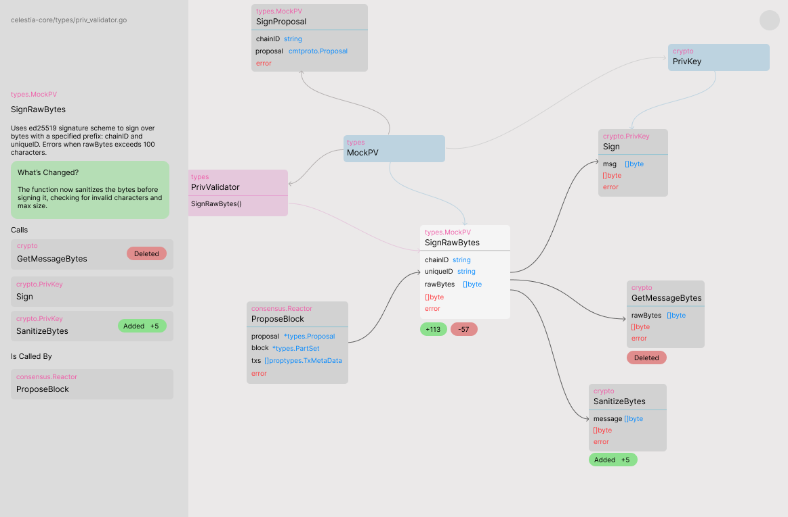

# Isoprism — UI Brief

> For AI generation and Figma design | Updated: 2026-04-21

---

## Design Language

**Typeface:** Inter (or equivalent geometric sans-serif). All body text 14–15px. Headings 20–28px. Monospace (JetBrains Mono or similar) for function signatures and code.

**Palette:**
- Background: `#0A0A0A` (near-black)
- Surface: `#111111` (cards, panels)
- Surface raised: `#1A1A1A` (hover states, expanded panels)
- Border: `#242424`
- Text primary: `#F0F0F0`
- Text secondary: `#888888`
- Text muted: `#555555`
- Accent (changed nodes): `#6366F1` (indigo-500)
- Accent dim (caller/callee nodes): `#312E81` (indigo-900, background) with `#818CF8` (indigo-400, text)
- Success: `#22C55E`
- Destructive: `#EF4444`

**Aesthetic:** Dark, minimal, instrument-like. Inspired by Linear and Vercel's dashboard. High contrast between text and background. No gradients. No shadows except subtle `box-shadow: 0 0 0 1px #242424` for card borders.

**Spacing system:** 4px base unit. Common values: 8, 12, 16, 20, 24, 32, 48px.

**Motion:** Subtle only. 150ms ease-out for state transitions. No entrance animations.

---

## Screen 1 — Login

**Layout:** Full viewport. Vertically and horizontally centred content column, max-width 360px.

**Content (top to bottom):**
1. Isoprism logo mark — a small abstract graph icon (3 nodes connected by 2 edges), 32×32px, white
2. Product name "Isoprism" in 20px semibold, white, 12px below the logo
3. 48px gap
4. Headline: "Understand what your PRs actually change." — 28px, semibold, white, centered, max 2 lines
5. Subheading: "A graph view of every function affected. Plain-language summaries. No diffs." — 15px, `#888888`, centered, 12px below headline
6. 40px gap
7. **GitHub sign-in button** — full width, 48px height, `#F0F0F0` background, `#0A0A0A` text, 8px border-radius. GitHub Octocat icon (20px) left of text "Continue with GitHub". On hover: `#FFFFFF` background.
8. 48px gap below button
9. Fine print: "By signing in you authorise read access to your repositories." — 12px, `#555555`, centered

**Background:** Solid `#0A0A0A`. No image, no pattern.

---

## Screen 2 — Repo Selection

**Layout:** Full viewport. Two zones:
- Left sidebar (240px wide, full height, `#111111` background, `#242424` right border)
- Main content area (remaining width)

**Left Sidebar:**
- Isoprism logo mark + "Isoprism" wordmark at top, 20px padding
- User avatar (24px circle) + GitHub username below, 16px text, `#888888`, at bottom of sidebar with 20px padding

**Main Content (centred column, max-width 560px, vertically centred in viewport):**
1. Heading: "Select a repository" — 24px semibold, white
2. Subheading: "Isoprism will index this repository's pull requests." — 15px, `#888888`, 8px below heading
3. 24px gap
4. **Search input** — full width, 44px height, `#111111` background, `#242424` border, 6px border-radius. Placeholder: "Search repositories…" in `#555555`. Magnifier icon on left inside.
5. 16px gap
6. **Repository list** — scrollable, max-height ~400px. Each row:
   - Height: 56px
   - `#111111` background, `#242424` border, 6px border-radius, 1px gap between rows
   - Left: repo name in 14px semibold white + org/owner prefix in `#555555` 13px
   - Right: language badge (e.g. "TypeScript") in `#1A1A1A` with `#555555` border, 11px text; and last-updated timestamp in `#555555` 12px
   - Selected state: `#1A1A1A` background, `#6366F1` left border (3px), repo name in `#6366F1`
   - Hover state: `#141414` background
7. 24px gap
8. **Continue button** — right-aligned, 140px wide, 44px height, `#6366F1` background, white text "Index repository →", 6px border-radius. Disabled (opacity 0.4) until a repo is selected.

---

## Screen 3 — Indexing State (transient)

**Layout:** Same two-zone layout as Screen 2. Main content centred column, max-width 480px.

**Content:**
1. Repo name + GitHub icon in small badge at top: `acme/backend`
2. 32px gap
3. Animated progress indicator — a horizontal bar, `#1A1A1A` track, `#6366F1` fill that animates from 0 to ~70% over 3 seconds then pulses. Width: full column. Height: 3px.
4. 16px gap
5. Status label — 14px, `#888888`, left-aligned under the bar. Cycles through:
   - "Fetching pull requests…"
   - "Analysing changed functions…"
   - "Building call graphs…"
   (Each phase lasts ~1.5s, fades between them)
6. When complete (no more than ~10 seconds), transition immediately to Screen 4 (PR Queue).

---

## Screen 4 — PR Queue

**Layout:** Same two-zone layout. Main content column max-width 720px, vertically positioned in upper half of viewport with top padding of 48px.

**Content:**
1. Breadcrumb: small text `acme/backend` in `#555555`, 13px, at top
2. 8px gap
3. Heading: "Pull requests" — 22px semibold, white
4. Subheading: "Top 5 open PRs ranked by wait time and impact." — 14px, `#888888`, 8px below
5. 24px gap
6. **PR List** — 5 rows. Each row is a card:
   - Height: auto, min 72px
   - `#111111` background, `#242424` border, 8px border-radius
   - 16px gap between cards
   - Hover state: `#141414` background, cursor pointer
   - **Left edge accent bar** (4px wide, full height): `#6366F1` for the highest urgency PR, `#312E81` for the rest
   
   **Card layout (16px internal padding):**
   - Row 1: PR number `#555555 · #42` and title `#F0F0F0` 15px semibold, inline
   - Row 2 (8px below): One-line AI summary — 14px `#888888`
   - Row 3 (10px below): Three small badges inline:
     - Time open: clock icon + "3 days" — `#1A1A1A` bg, `#888888` text, 11px
     - Functions affected: graph-node icon + "12 functions" — same style
     - Risk: coloured dot + "Medium risk" — dot colour matches risk level (green/amber/red), `#888888` text
   - Far right: chevron `›` in `#555555`, vertically centred

---

## Screen 5 — PR Graph View

This is the primary screen. It has two zones:

```
┌──────────────────┬───────────────────────────────────────┐
│                  │                                       │
│  Node Detail     │  Graph Canvas                        │
│  Panel           │                                       │
│  (~280px)        │  (remaining width)                   │
│                  │                                       │
└──────────────────┴───────────────────────────────────────┘
```



**Important:** Both the Node Detail Panel and Graph Canvas use a **light theme** (panel `#DCDCDC`, canvas `#EBE9E9`; dark text).

---

### Node Detail Panel (~280px wide, `#DCDCDC` background, right border `1px #E4E4E4`)

This panel updates when the user clicks a node in the graph. Default state (no node selected) shows:

**Default state:**
- Centred placeholder text: "Select a node to inspect it." — 14px `#999999`

**Node selected state (top to bottom, 20px padding):**

1. **File path** — `path/to/file.go` — 11px, `#AAAAAA`, at very top. This is the source file where the function is defined.

2. **Package label** — e.g. `types.MockPV` — 11px, package color (see Package Color Table below), 8px below file path.

3. **Function name** — 22px semibold, `#111111`, 4px below package label.

4. **Description** — 14px, `#555555`, line-height 1.6, 12px below name. 2–3 sentences describing what the function does.

5. **"What's Changed?" card** (only for directly modified functions) — 16px below description:
   - Container: `#F0FFF4` background, `#BBF7D0` left border (3px), 8px border-radius, 12px padding.
   - Label: "What's Changed?" — 12px semibold, `#166534`, margin-bottom 6px.
   - Body: 13px, `#333333`, line-height 1.6. 2 sentences max describing what specifically changed.

6. **"Calls" section** — 20px below the changed card (or description if no change card):
   - Label: "Calls" — 11px uppercase, `#AAAAAA`, letter-spacing 0.08em.
   - **Call rows** (one per called function, 8px gap between rows): each row is a horizontal flex container:
     - Left: package label (11px, package color) + function name (13px, `#222222`), stacked vertically or inline.
     - Right: optional status badge (see below). Right-aligned.
   - If no calls, omit section.

7. **"Is Called By" section** — 16px below Calls, same row structure.

**Status badges** (appear on call rows in the panel, and on nodes in the graph):
- **Deleted** — red pill: `#FEE2E2` background, `#EF4444` text, 10px, 4px border-radius. Shown when a call relationship was removed.
- **Added +N** — green pill: `#DCFCE7` background, `#16A34A` text, 10px, 4px border-radius. The `+N` is the line count added. Shown when a call was newly introduced.

---

### Graph Canvas (remaining width, `#EBE9E9` background)

The graph is an interactive force-directed graph. Changed nodes tend to be positioned centrally; callers and callees radiate outward organically.

**Graph layout:** Force-directed. No strict row hierarchy. Changed nodes gravitate toward the centre of the viewport. Related nodes cluster near their connections. Pan and zoom freely.

**Package Color Table** — used consistently across node labels, edge colors, and panel labels:

| Package prefix | Color |
|---|---|
| `types` | `#3B82F6` (blue) |
| `crypto` | `#06B6D4` (cyan) |
| `consensus` | `#EC4899` (pink) |
| `p2p` | `#F59E0B` (amber) |
| `rpc` | `#8B5CF6` (violet) |
| other / unknown | `#6B7280` (gray) |

**Node anatomy** (white card, `box-shadow: 0 1px 4px rgba(0,0,0,0.12)`, 8px border-radius, no border, 10px padding):
- **Package label** — 11px, package color (see table), top of card.
- **Function name** — 13px semibold, `#111111`, 3px below package label.
- **Parameters** — listed below function name, one per line: `paramName  type` where the type is rendered in the package color of that type's package (or gray if primitive). 11px, 3px line gap.
- **Return types** — same style as params, below a 1px `#EEEEEE` divider, 4px below last param.
- **Diff stat badges** (bottom of card, only on directly changed nodes): green pill `+N` and red pill `-N` showing lines added/removed. Same pill style as status badges above. 8px margin-top.
- **Status badge** (bottom-right, for nodes whose relationship to the changed function is new or deleted): "Deleted" red pill or "Added +N" green pill.

**Node states:**
- **Default:** white card, standard shadow.
- **Selected:** white card, stronger shadow `0 4px 16px rgba(0,0,0,0.18)`, cursor pointer.
- **Hover:** `box-shadow: 0 2px 8px rgba(0,0,0,0.15)`, cursor pointer.

**Edges:**
- Thin bezier curves, 1px stroke.
- Color matches the **source node's package color** (same color as the source's package label).
- No arrowheads, or a very subtle 4px filled triangle at the target end.

**Zoom controls:** bottom-right corner. `+` / `−` / `⊡ fit` buttons, 36px each, `#FFFFFF` bg, `#E4E4E4` border, 6px border-radius, `#444444` icon text. User can also pinch-zoom and drag to pan.

**Empty area behaviour:** Clicking empty canvas deselects the current node (panel returns to default state).

**Node count cap:** Maximum 20 nodes displayed. If the graph would exceed this, show a small notice: "Showing 20 of {n} affected functions" in `#AAAAAA` 12px in the bottom-left of the canvas.

---

## Responsive Behaviour

The prototype is designed for desktop only (1280px+ wide screens). No mobile layout required. On screens narrower than 900px, show a message: "Isoprism is designed for desktop. Please open on a larger screen."

---

## Interaction Summary

| Action | Result |
|---|---|
| Click PR card | Navigate to PR Graph View for that PR |
| Click graph node | Update Node Detail Panel with that node's data |
| Click "Show diff" | Expand inline diff inside Node Detail Panel |
| Click node chip in "Calls" / "Called by" | Pan graph to that node and select it |
| Click empty canvas | Deselect node, panel shows default state |
| Click "View on GitHub →" | Open GitHub PR URL in new tab |
| Click back breadcrumb | Return to PR Queue |
| Zoom controls | Zoom graph canvas in/out or fit to screen |
| Keyboard: `Escape` | Deselect current node |

---

## Component Inventory

| Component | Description |
|---|---|
| `LoginPage` | Full-screen login with GitHub button |
| `RepoSelector` | Searchable repo list with single-select |
| `IndexingState` | Animated progress bar with status messages |
| `PRQueue` | List of 5 PR cards with urgency ordering |
| `PRCard` | Single PR row: title, summary, badges, chevron |
| `GraphCanvas` | Force-directed graph canvas (pan/zoom/click), light `#EBE9E9` bg |
| `GraphNode` | White card node: package label, function name, params, return types, optional diff badges |
| `NodeDetailPanel` | Light-theme side panel (`#DCDCDC` bg): file path, package label, function name, description, What's Changed card, Calls/Called-by rows |
| `StatusBadge` | Pill badge for Added/Deleted status on call rows and canvas nodes |
| `DiffStatBadge` | `+N` / `-N` pill badges shown on changed nodes in the canvas |
| `TopBar` | PR breadcrumb, title, and GitHub link (dark theme) |
| `AppSidebar` | Narrow left sidebar with logo and user avatar |
